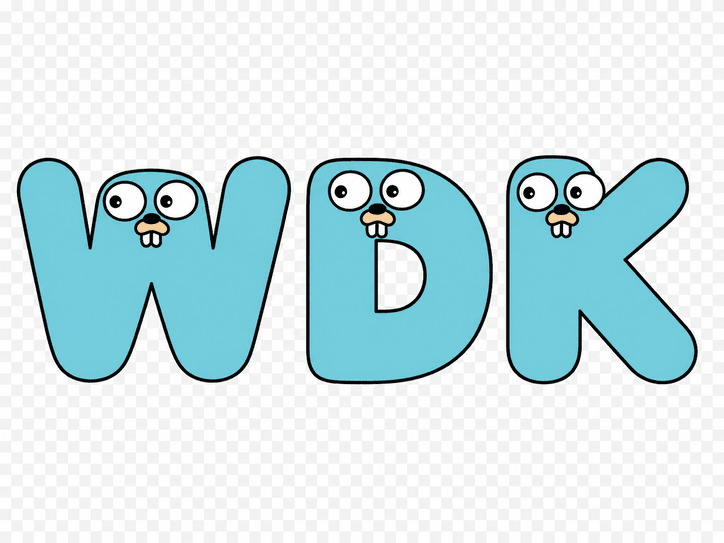

<p align="center">
  
</p>

# GOWDK

[](https://github.com/cssbruno/GOWDK/actions/workflows/ci.yml)
[](https://github.com/cssbruno/GOWDK/actions/workflows/release.yml)


GOWDK is a compiler and runtime for shipping Go web apps. Write `.gwdk` files,
get build-time pages, request-time backend behavior, opt-in SSR, and one-binary
deploys while keeping application logic in Go.

GOWDK Compiler owns `.gwdk` parsing, analysis, route metadata, endpoint
metadata, assets, generated adapter source, diagnostics, and LSP support.
GOWDK Runtime owns serving, request context, actions, APIs, fragments, CSRF,
contracts, SSR hooks, embedded assets, and one-binary wiring.

Live demo: [gowdk.com](https://gowdk.com/)
Demo source: [cssbruno/gowdk-page](https://github.com/cssbruno/gowdk-page)

**Status:** pre-release. Public contracts can still change. Not production
ready.

## What It Looks Like

```gwdk
// pages/home.page.gwdk
package pages

import copy "github.com/acme/app/content"

use ui "components"

@page home
@route "/"

build {
  => copy.HomePageForBuild()
}

view {
  <main>
    <h1>{title}</h1>
    <p>{canonicalPath}</p>
    <ui.Counter />
  </main>
}

style {
  h1 { color: #0f766e; }
}
```

```go
// content/home.go
package content

import (
	"strings"
)

type PageCopy struct {
	Title         string `json:"title"`
	Slug          string `json:"slug"`
	CanonicalPath string `json:"canonicalPath"`
}

func HomePageForBuild() PageCopy {
	title := "GOWDK ships apps"
	slug := strings.ToLower(strings.ReplaceAll(title, " ", "-"))

	return PageCopy{
		Title:         title,
		Slug:          slug,
		CanonicalPath: "/posts/" + slug,
	}
}
```

```gwdk
// components/counter.cmp.gwdk
package components

import ui "github.com/acme/app/ui"

@component Counter

state ui.CounterState = ui.NewCounterState()

client {
  computed Label string {
    return if Count == 0 { "Start" } else { string(Count) }
  }

  fn Increment() {
    Count++
  }

  fn Reset() {
    Count = 0
  }
}

view {
  <section .counter>
    <p class:active={Count > 0}>{Label}</p>
    <button g:on:click={Increment()}>Add</button>
    <button g:if={Count > 0} g:on:click={Reset()}>Reset</button>
  </section>
}

style {
  .counter { display: grid; gap: 0.75rem; }
  .active { color: #0f766e; }
}
```

Programming logic stays in Go. Today that means normal `.go` files imported or
referenced from `.gwdk`, plus default `go {}` blocks for colocated
static helpers. Saved default `go {}` blocks are type-checked with
sibling Go files during validation. `build {}` can call an imported or inline
no-argument Go function at build time, JSON-encode its returned object, and
expose scalar fields to `view {}`. Request-time and addon-targeted go blocks are
parsed and validated; generated apps can execute `go ssr {}` load handlers,
page-level `go client {}` can opt into client-side Go by exporting
`//go:wasmexport GOWDKMount<PageID>` for a generated WASM page loader, and
configured addons that implement `gowdk.GoBlockConsumer` can validate
`go addon.<name> {}` blocks and emit generated app Go files. Generated app source
materializes default `go {}` and `go ssr {}` blocks as normal Go
packages under `gowdk_go/`.

Pages can stay build-time while components own local reactive state; the
compiler generates the island runtime for `client {}` handlers, computed
values, bindings, class toggles, and conditional DOM.

### API And Frontend In One File

Page files can declare backend endpoints beside the frontend they serve. Default
`go {}` blocks can provide build-time copy and same-page API handlers when the
handler uses the supported API signature.

```gwdk
// pages/dashboard.page.gwdk
package pages

@page dashboard
@route "/dashboard"

api Session GET "/api/session"

build {
  => DashboardCopyForBuild()
}

go {
import (
	"context"
	"net/http"
	"strings"

	"github.com/cssbruno/gowdk/runtime/response"
)

type DashboardCopy struct {
	Title   string `json:"title"`
	Summary string `json:"summary"`
}

func DashboardCopyForBuild() DashboardCopy {
	return DashboardCopy{
		Title:   "Dashboard",
		Summary: "This page and its API live in one GOWDK file.",
	}
}

func Session(_ context.Context, request *http.Request) (response.Response, error) {
	user := strings.TrimSpace(request.URL.Query().Get("user"))
	if user == "" {
		user = "guest"
	}

	return response.JSONValue(http.StatusOK, map[string]any{
		"authenticated": user != "guest",
		"user":          user,
		"source":        "pages/dashboard.page.gwdk",
	})
}
}

view {
  <main class="dashboard">
    <section class="panel">
      <h1>{title}</h1>
      <p>{summary}</p>

      <form method="get" action="/api/session">
        <label for="user">User</label>
        <input id="user" name="user" value="ada" />
        <button type="submit">Open API JSON</button>
      </form>

      <a href="/api/session?user=ada">Inspect session API</a>
    </section>
  </main>
}

style {
  .dashboard { min-height: 100vh; display: grid; place-items: center; }
  .panel { display: grid; gap: 1rem; max-width: 34rem; }
  form { display: flex; gap: 0.5rem; align-items: end; }
}
```

## How It Works

- Build-time by default: full pages compile to SPA output with route and asset
  manifests.
- Request-time only where needed: `@render ssr` opts a page into supported
  `load {}`, guards, route params, redirects, and generated error pages.
- Backend behavior without full SSR: actions, APIs, fragments, commands, and
  queries run per request without making every page request-rendered.
- Direct CSS: `style {}` emits generated CSS assets. Component CSS, scoped CSS,
  processors, and Tailwind CLI integration are available in bounded slices.
- Generated Go is adapter glue: generated code can decode supported typed
  inputs, validate supported form fields, wire CSRF, run guards, and apply
  optional rate limiting.
- One-binary deploys: generated apps can embed frontend output and request-time
  handlers into a single Go binary.

## Event-Driven Contracts

GOWDK can enable a typed contract runtime through the contracts addon:

```text
UI event -> command/query -> backend handler -> backend event
UI <- result or presentation event
```

- `g:command` binds forms to backend commands.
- `g:query` binds elements to readonly backend queries.
- Commands have one owner.
- Domain and integration events are emitted after command success.
- Presentation events notify UI but are not trusted input.
- Jobs, event capture/replay, role filtering, graph/trace CLI, file outbox,
  local in-memory broker, Redis Streams, NATS, SSE, and WebSocket fanout
  support exist today.

See [Contracts](docs/reference/contracts.md).

## Install

```sh
git clone https://github.com/cssbruno/GoWDK.git
cd GoWDK
go build ./cmd/gowdk
```

## Quickstart

### Scaffolded App

```sh
./gowdk init --tests --template site ~/my-app
cd ~/my-app
/path/to/GoWDK/gowdk build
./bin/site
```

Open `http://127.0.0.1:8080`.

The scaffolded config builds hidden frontend output in `.gowdk/output/site`,
generates `.gowdk/site`, and compiles `bin/site`. Use
`gowdk serve --dir .gowdk/output/site` only for static inspection; it does not
run backend handlers.

### Ad Hoc Binary

```sh
/path/to/GoWDK/gowdk build --app dist/app --bin dist/my-app
./dist/my-app
```

This builds a Go binary that serves embedded frontend output alongside
supported backend handlers, commands, queries, fragments, and SSR routes.

## CLI Reference

```sh
gowdk init [dir]
gowdk check
gowdk build [--app <dir>] [--bin <file>]
gowdk dev
gowdk serve --dir <dir>
gowdk contracts | graph | trace | list
gowdk fmt | manifest | sitemap | routes | lsp
```

See [CLI reference](docs/reference/cli.md).

## Current Status

| Area | Status |
| --- | --- |
| Pages, routes, layouts, and render modes | Available |
| Build-time SPA output | Available |
| Actions, APIs, and fragments | Available |
| Commands, queries, and contracts addon | Available |
| Direct `style {}` CSS assets | Available |
| One-binary deploys | Available |
| LSP server | Available |
| SSR with `load {}`, guards, params, and errors | Partial |
| Component behavior, client behavior, and scoped CSS | Partial |
| WASM islands | Partial |
| `go {}` metadata for inline Go authoring | Available |
| Build-time default go block functions for `build {}` | Partial |
| Client-side `go client {}` page mounts through Go WASM | Partial |
| Request-time `go ssr {}` load execution | Partial |
| Addon inline Go adapter file generation | Partial |
| Hybrid rendering beyond explicit request-time branches | Planned |
| Split worker/cron contract wiring | Planned |
| Durable outbox, broker, and realtime adapters | Partial |
| Production operations guidance | Planned |

See [Requirements](docs/product/requirements.md) for the full status table and
[Roadmap](docs/product/roadmap.md) for planned work.

## Docs

- [Getting started](docs/getting-started.md)
- [Language](docs/language/README.md)
- [Contracts](docs/reference/contracts.md)
- [CLI reference](docs/reference/cli.md)
- [Architecture](docs/engineering/architecture.md)
- [Requirements](docs/product/requirements.md)
- [Roadmap](docs/product/roadmap.md)
