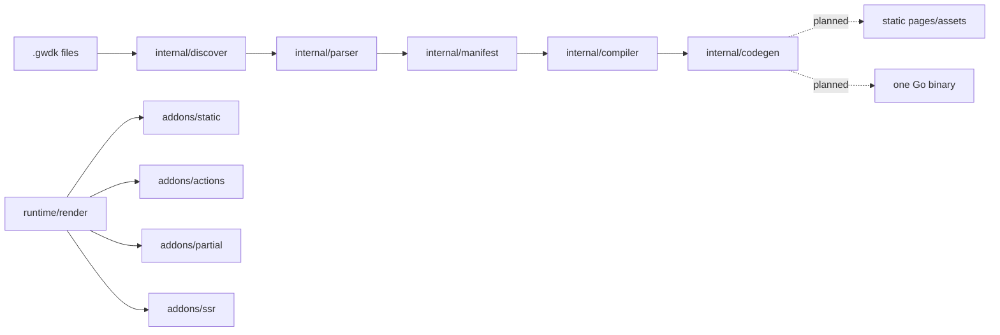

# Architecture

## Current Status

GOWDK is compile-first. The current repository discovers `.gwdk` files, parses page metadata and component files with first-slice syntax validation, validates render-mode, duplicate identity, route shape, route ownership, and required page-view rules, emits manifest/site-map JSON, plans route bindings, can emit static HTML plus static route and asset manifests for simple build-time pages, the first literal dynamic path subset, literal build data, first-slice imported Go build functions, and partial client runtime assets through `gowdk build --out`, can skip identical generated static/app writes, can generate an embedded static app through `gowdk build --app`, can compile that app through `--bin` or `--wasm`, can package selected configured modules into generated apps, binaries, and WASM artifacts through static `Build.Targets` or ad hoc repeated/comma-separated `--module`, can rebuild on content-hash changed inputs through `gowdk watch`, can incrementally render existing changed page sources for plain static watch output, can restart one generated binary after successful watched rebuilds through `watch --restart`, and can serve generated static output locally through `gowdk serve`.

It does not yet emit real user Go type-bound action decoders, user action
logic, CSRF-wired generated handlers, API handlers, rich local client-side
reactivity, request-time `load {}` execution, dynamic SSR routes, or general
request-time route handlers in the generated binary. Generated embedded apps can
serve the first simple concrete `@render ssr` page slice and first-slice partial
action fragment responses.

## System Context

GOWDK users write portable `.gwdk` pages and components. In the target architecture, the compiler discovers those files, builds a manifest, validates render rules, emits static assets and Go handlers, and packages output for static serving or one-binary deploy.

The target core output can include static pages, components, typed actions, API handlers, server fragment handlers, embedded assets, and a Go binary. CSS tooling, including Tailwind, belongs in optional addons or plugins rather than the initial core. SSR is enabled only when `ssr.Addon()` is present and a page opts into request-time rendering.

## Components

| Component | Responsibility | Owner | Notes |
| --- | --- | --- | --- |
| `cmd/gowdk` | CLI entrypoint. | Core | Exposes `version`, `tokens`, `fmt`, `check`, `manifest`, `sitemap`, `build`, `watch`, `serve`, and `lsp`. `build` can emit static files, generated embedded app source, an optional binary, and an optional WASM artifact for all discovered sources, selected configured modules, or static `Build.Targets`; `watch` compares input content hashes and can use incremental static rendering for page-only plain output changes; `watch --restart` can restart one generated binary after successful rebuilds. |
| `gowdk` root package | Public config, render modes, addon registration, and CSS plugin contracts. | Core | Includes `Config`, `RenderMode`, `Addon`, `CSSConfig`, and `CSSProcessor`. |
| `internal/discover` | Find portable `.gwdk` files from include/exclude patterns. | Compiler | Recursive glob discovery implemented. |
| `internal/parser` | Parse `.gwdk` page/component annotations and top-level block declarations. | Compiler | Minimal metadata parser implemented, including first action body subset, unknown/malformed annotation rejection, and unsupported top-level block rejection. |
| `internal/view` | Parse and render the first static `view {}` markup subset. | Compiler | Lowercase HTML elements, static/boolean/expression attributes, shorthand class/id normalization, escaped text/attribute interpolation, self-closing component calls, and prop interpolation implemented. |
| `internal/lang` | Language tooling for lexing, diagnostics, formatting, checking, and manifest output. | Tools | Initial CLI-backed tools implemented. |
| `internal/lsp` | Language Server Protocol bridge for diagnostics, formatting, and completions. | Tools | Dependency-free stdio server implemented. |
| `internal/manifest` | Normalize discovered pages, routes, blocks, layouts, render modes, paths, and guards. | Compiler | Initial page model implemented. Public manifest JSON is currently narrower than the internal model. |
| `internal/project` | Load project-level config, module source groups, build targets, and future source roots. | Compiler | Static `gowdk.config.go` subset implemented for build discovery, output, and `Build.Targets`. |
| `internal/compiler` | Validate manifests and coordinate compilation. | Compiler | Render-mode, duplicate identity, route shape, duplicate route param, duplicate route pattern, route-method, and required page-view validation implemented. |
| `internal/codegen` | Emit route behavior plans and future Go, HTML, CSS, and asset artifacts. | Compiler | Route-binding planning implemented; artifact emission is planned. |
| `internal/staticgen` | Emit route-derived static HTML files for build-time pages and first-slice SSR render artifacts. | Compiler | Initial simple page, literal build data, imported Go build data calls, literal dynamic path expansion, component expansion, partial runtime asset emission, simple concrete SSR page rendering, route manifest emission, asset manifest emission, identical-output write skipping, and incremental changed-page static rendering implemented. |
| `internal/appgen` | Emit dependency-free generated Go app source for embedded static output and first-slice request-time routes. | Compiler | Generates `go.mod`, `main.go`, copied static assets, first-slice POST redirect and partial fragment action handlers, form input decoders, simple concrete SSR route handlers, identical-output write skipping, stale embedded static cleanup, and can invoke `go build` for local binaries or Go `js/wasm` artifacts. |
| `internal/clientrt` | Emit client runtime for partial updates. | Runtime | First partial form enhancement runtime emits lifecycle hooks, target/swap request headers, swaps, focus restoration, and loading state metadata. |
| `runtime/render` | Core rendering engine used by static, actions, partials, and SSR. | Runtime | Renderer and generated-code builder implemented; expression text writes escape by default. |
| `runtime/component` | Generated component runtime contract. | Runtime | Initial component interface implemented. |
| `runtime/html` | HTML escaping, attributes, and class helpers. | Runtime | Initial helpers implemented. |
| `runtime/form` | Form value normalization and generated decoder support. | Runtime | Values and first-slice allowlist decoding helpers implemented. |
| `runtime/validation` | Validation result and errors for actions. | Runtime | Initial result model implemented. |
| `runtime/response` | HTML, redirect, fragment, and JSON response envelopes. | Runtime | Initial response model implemented. |
| `runtime/asset` | Asset manifest resolution. | Runtime | Initial manifest helper implemented. |
| `addons/static` | Build-time prerendering. | Addon | Capability boundary implemented; prerender execution is planned. |
| `addons/actions` | Typed backend actions, form decoding, CSRF. | Addon | Capability boundary, required-field validation helper, and signed CSRF validator implemented; generated user action execution is planned. |
| `addons/partial` | Server fragments and swaps. | Addon | Capability boundary implemented; first generated action fragment execution slice exists. |
| `addons/ssr` | Request-time full-page rendering. | Addon | Capability boundary plus load context, guard execution, router registration, layout stack, and default error handler contracts implemented; generated embedded apps can serve first-slice concrete SSR pages. |
| `addons/api` | Generated API handlers. | Addon | Capability boundary implemented; handler generation is planned. |
| `addons/embed` | Embedded assets and one-binary serving. | Addon | Capability boundary implemented; generated embedding is planned. |
| `addons/css` | Compile-time CSS processing. | Addon | CSS feature registration and processor aliases implemented. |
| `addons/tailwind` | Tailwind CSS standalone CLI integration. | Addon | Experimental no-npm Tailwind v4 CSS processor wrapper; users provide the executable. |
| `addons/ratelimit` | Request-time HTTP rate limiting. | Addon | Middleware, fixed-window result contract, in-memory store, and Redis-backed store adapter implemented; generated handler wiring is planned. |

## Data Model

The internal compiler manifest includes page identity, source path, route, render mode, layouts, guard metadata, whether static paths exist, captured `paths {}` and `build {}` source text, and declared blocks. Current public manifest JSON is intentionally smaller: it includes route, effective render mode, layouts, paths presence, and guards. Site-map JSON includes source paths, dynamic params, and block presence for editor tooling.

Generated static binaries embed this manifest with the rest of the static output,
but request-time generated route handlers do not consume it yet.

Example manifest shape:

```json
{
  "pages": {
    "home": {
      "route": "/",
      "render": "static",
      "layouts": ["root"]
    },
    "blog.post": {
      "route": "/blog/{slug}",
      "render": "static",
      "paths": true,
      "layouts": ["root", "blog"]
    },
    "dashboard": {
      "route": "/dashboard",
      "render": "ssr",
      "layouts": ["root", "dashboard"],
      "guard": ["auth.required"]
    }
  }
}
```

## API And Integration Contracts

Application config:

```go
var Config = gowdk.Config{
	AppName: "Clinic",
	Source: gowdk.SourceConfig{
		Include: []string{
			"src/**/*.gwdk",
		},
	},
	Modules: []gowdk.ModuleConfig{
		{Name: "frontend", Type: "frontend"},
		{
			Name: "admin",
			Type: "admin-ui",
			Source: gowdk.SourceConfig{
				Include: []string{"frontends/admin/**/*.gwdk"},
			},
		},
		{
			Name: "backendmicroservice",
			Type: "backendmicroservice",
			Source: gowdk.SourceConfig{
				Include: []string{"services/backend/**/*.gwdk"},
			},
		},
	},
	Render: gowdk.RenderConfig{
		Default: gowdk.Static,
	},
	Build: gowdk.BuildConfig{
		Output: "dist/clinic",
		Assets: gowdk.Embed,
	},
	Addons: []gowdk.Addon{
		static.Addon(),
		actions.Addon(),
		partial.Addon(),
		embed.Addon(),
		ssr.Addon(),
	},
}
```

Block semantics:

- `paths {}` runs at build time and declares dynamic static routes.
- `build {}` runs at build time and feeds static rendering.
- `load {}` runs at request time and requires SSR or hybrid rendering.
- `act {}` runs POST/action requests.
- `api {}` runs API requests.
- `view {}` renders markup.

Target generated route behavior:

```go
mux.HandleFunc("GET /", embedded.Static("pages/home.html"))
mux.HandleFunc("POST /newsletter", actions.NewsletterSubscribe)
mux.HandleFunc("GET /dashboard", ssr.RenderDashboard)
mux.HandleFunc("GET /api/patients", api.PatientsIndex)
```

The current code can plan route bindings for these cases and can emit static HTML files, CSS assets from compile-time processors and discovered page CSS inputs, stylesheet links, `gowdk-routes.json`, `gowdk-assets.json`, and the partial-update client runtime when needed for simple build-time pages with explicit or discovered component and layout files. It expands the first literal `paths {}` subset for dynamic static routes, binds those route params plus literal `build {}` data or imported Go build data into the current static `view {}` interpolation context, and composes static page layouts through each layout's single `<slot />`; literal `build {}` string values can also interpolate current route params. It parses the first action body subset and can generate static POST redirect handlers plus first-slice form input decoder, required-field validation wrappers, and partial fragment responses for concrete page routes. `gowdk build --app` can also generate first-slice concrete SSR routes for `@render ssr` pages that do not use `load {}` or dynamic route params. `internal/codegen` can emit registry-backed action HTTP handlers that decode form values, call registered application handlers, and write `runtime/response.Response` envelopes; it can also emit first-slice API and SSR handler/load stubs, plus fragment render functions and handlers. `gowdk build --app` can generate an embedded Go app from that output, and `--bin` can compile it. `gowdk serve` can serve the generated static directory locally. It does not emit real user Go type-bound action decoders, wire the registry-backed action package into the generated app, generate CSRF wiring, execute user action logic before fragments, run SSR `load {}` functions, enforce generated guards, render dynamic SSR routes, or apply page-aware CSS processor selections yet. Only pages marked `@render ssr` or future accepted hybrid request-time branches should use request-time full-page rendering.

Guard annotations are parsed and exposed in manifest/site-map output. The SSR
addon defines guard function and ordered execution contracts, but generated
handlers do not enforce authentication or authorization yet.

Language tool commands:

```sh
gowdk tokens <file.gwdk>
gowdk fmt [--write] <file.gwdk>
gowdk check [--ssr] <file.gwdk>
gowdk manifest [--ssr] <file.gwdk>
gowdk sitemap [--ssr] <files>
gowdk build [--config <file>] [--ssr] [--target <name>] [--module <name>] [--out <dir>] [--app <dir>] [--bin <file>] [--wasm <file>] [files...]
gowdk watch [--once] [--restart] [--interval <duration>] [build flags...]
gowdk serve --dir <dir> [--addr <addr>]
gowdk lsp [--ssr]
```

When `gowdk build` receives no explicit files, it loads literal root source, module source, and build target settings from `gowdk.config.go` when present. A module with a name but no explicit include defaults to `<module-name>/**/*.gwdk`. Static `Build.Targets` declare named module sets, output dirs, generated app dirs, binary paths, and WASM paths; with targets configured, `gowdk build` runs every target and `--target <name>` limits the run to selected targets. `--module <name>` remains available for ad hoc builds and may be repeated or comma-separated. The selected modules define the source set compiled into `--out`, copied into `--app`, and embedded into `--bin` or `--wasm`, so projects can build one-module binaries, multi-module binaries, WASM artifacts, or different artifacts from different module sets. Without configured root or module includes it discovers `**/*.gwdk` under the current working directory. Discovery excludes `.git`, `vendor`, `node_modules`, configured source excludes, and the selected output directory. Module type is user-defined metadata today; future generated-output work can use it to separate frontend, backend, and service artifacts. The VS Code extension uses `gowdk sitemap` to render a visual route map. Because routes are declared inside `.gwdk` files, the visualizer can move a page file without changing the page route.

LSP-capable editors can use `gowdk lsp` over stdio for live buffer diagnostics, document formatting, and keyword completions. The first LSP version uses full-document synchronization and validates one open buffer at a time with the same parser and compiler rules as `gowdk check`.

## Key Quality Attributes

- Scalability: static output should serve without request-time page rendering.
- Reliability: invalid render modes and missing addon requirements must fail at compile time.
- Security: actions must own form decoding, validation, CSRF, and redirect behavior.
- Observability: manifests and site maps should explain route behavior and render mode.
- Maintainability: runtime render core stays separate from `addons/ssr`.

## Diagrams


