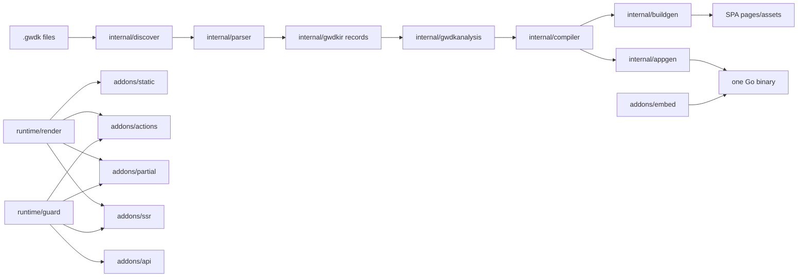

# Architecture

## Current Status

GOWDK is compile-first. The current repository discovers `.gwdk` files, parses
page, component, layout, endpoint, client, CSS, asset, and source-import
metadata into a typed GOWDK AST, lowers that AST into compiler IR, validates
route/render/component/handler contracts, emits manifest/site-map/build-report
metadata plus non-served security posture reports, and generates build-time SPA
output, generated app source, local binaries, and Go `js/wasm` deploy
artifacts.

Generated build output covers simple static pages, literal dynamic `paths {}`
entries, literal, default `go {}`, and same-package/imported no-argument `build {}` data returning `T` or `(T, error)`,
declared layouts, discovered components, page CSS, processor-emitted CSS,
partial-update client assets, generated JavaScript island assets, component-level
browser WASM island assets, route manifests, asset manifests, source-linked
inspect trees, endpoint dispatch graphs, OpenAPI and AsyncAPI inspection
artifacts, `gowdk-security.json` posture reports outside served output, and
cache metadata. The build pipeline skips identical generated writes and can
incrementally render page-only SPA edits in the dev loop.

Generated apps use `runtime/app` and `net/http` handler contracts. They can
serve embedded build output, feature-bound action/API handlers, CSRF-wired
action POSTs, first supported action redirect and fragment responses,
standalone fragment routes, guards, rate-limit hooks, endpoint panic
boundaries, optional generated error documents, concrete and dynamic
request-time SSR pages with declared `load {}` fields, safe local load
redirects, and inline `go ssr {}` load handlers through the generated
request-time route lane.
Backend adapter generation lowers request-time endpoint metadata into typed
appgen IR before emitting imports, route registrations, request decoders,
handler calls, response writing, fallback metadata, split frontend proxy route
matching, and backend-only app routing. The app generator uses typed IR and Go
AST/printer output before `go/format`.

`runtime/contracts` now provides the first local typed registry for queries,
commands, backend-owned domain and integration events, presentation events, and
jobs. Compiler IR command/query references, `.gwdk` command/query syntax,
local/imported handler and contract-type diagnostics, CLI graph/trace output,
and runtime role filtering exist.
Generated web adapters can execute routable command/query references through
the local registry with the `web` role, compiler validation rejects web
references to non-web-only registrations, and `runtime/contracts/fileoutbox`
provides a dependency-free JSON Lines outbox/EventSource adapter with nack
retry metadata and opt-in dead-letter storage. Runtime also includes in-memory
broker/EventSource and SSE presentation fanout adapters in the root module.
Concrete Redis Streams, NATS, and WebSocket adapters live as nested optional Go
modules under `runtime/contracts` so those third-party clients do not enter the
root module graph. Durable event envelopes carry stable IDs, workers can use
in-memory, file-backed, or Redis seen stores to skip duplicates inside a
post-ack deduplication window, and generated apps can expose contract event sink
registration, fresh registry construction, and worker replay helpers for
executable contract registrations. Split runtime binaries, retry backoff policy, and managed
deployment recipes remain planned.

Still partial: broad local client-side reactivity, richer hybrid streaming and
data refresh, non-HTTP revalidation, split worker/cron contract adapter wiring,
app-wide middleware policy, and managed deployment recipes.

## System Context

GOWDK users write portable `.gwdk` pages and components. GOWDK Compiler is the
language/compiler layer: it discovers those files, builds compiler metadata,
validates render rules, emits assets and generated Go adapters, and packages
output for hosted files or app binaries. GOWDK Runtime is the app/runtime
layer: it serves generated output, runs request-time handlers, and owns the
public runtime/addon packages used by generated adapters.

The target GOWDK Compiler plus GOWDK Runtime output can include spa pages,
components, typed actions, API handlers, server fragment handlers, embedded
assets, and a Go binary. CSS tooling, including Tailwind, belongs in optional
addons rather than the compiler core or runtime core. SSR is enabled
only when `ssr.Addon()` is present and a page opts into request-time rendering.

When this document uses `Compiler`, it means GOWDK internals under `internal/`.
When it uses `Runtime` or `Addon`, it means implementation packages that belong
to GOWDK Runtime. Avoid reading those owner labels as separate product names.

## Compiler Lanes

Target `.gwdk` compilation:

```text
.gwdk file
  -> GOWDK parser
  -> GOWDK AST
  -> GOWDK analyzer
  -> generated normal Go code
  -> go/format
  -> go build
```

Target Go package validation:

```text
.go package directory
  -> go/packages load
  -> standard Go syntax and type information
  -> validate exported handlers/types
```

The GOWDK AST models `.gwdk` language constructs. Normal Go files and generated
Go source use the standard Go syntax and type information. Analyzer output
connects the lanes through package, route, type, component, and handler binding
metadata.

## Compatibility Records

`internal/gwdkir.Program` is the single compiler handoff. The pipeline is
`source -> GOWDK AST (gwdkast) -> IR records (gwdkir) -> program assembly
(gwdkanalysis.BuildProgram) -> validation/discovery/binding (compiler) ->
generated output (buildgen/appgen)`. The former `internal/manifest`
compatibility model has been removed entirely:

- `internal/parser` lowers the typed AST directly into `gwdkir` page,
  component, and layout records.
- `internal/gwdkanalysis.BuildProgram` assembles `gwdkir.Program` from those
  records (routes, templates, assets, endpoints, packages) and exposes
  `AddStandaloneEndpoints`/`AttachBackendBindings` for the post-assembly
  enrichment phases.
- `internal/compiler` validates, discovers standalone Go endpoints, and binds
  backend handlers against the IR.
- The `gowdk manifest` JSON report keeps its historical field names but is
  derived from the IR (`internal/lang/manifest_json.go`); a golden test pins
  the output.
- Shared leaf value types (source spans, route params, inline scripts, backend
  binding records and signature enums, error-page path validation) live in the
  neutral `internal/source` package.

New generated-output work should consume `internal/gwdkir.Program` or add
fields there first.

No generation path depends on a manifest compatibility record. The remaining
`manifest` references in the tree are not compatibility models: the build-time
`routeManifest`/`assetManifest` JSON *output* artifacts (`internal/buildgen`),
the IR-derived public `gowdk manifest` report (`internal/lang/manifest_json.go`),
the runtime `LoadAssetManifest` asset lookup, the `<… manifest>` HTML attribute
allow-list (`internal/view`), and historical-context code comments.

Golden tests pin each handoff stage end to end: AST
(`internal/parser/testdata/golden`), IR (`cmd/gowdk/testdata/inspect_ir_golden`),
routes and endpoints (`cmd/gowdk/testdata/routes_golden`), generated Go
(`internal/appgen/testdata/generated_go_golden`), generated HTML and route/asset
output manifests (`internal/buildgen/testdata/full_fixture`), and the public
manifest report (`internal/lang/testdata/manifest_golden`).

## Components

| Component | Responsibility | Owner | Notes |
| --- | --- | --- | --- |
| `cmd/gowdk` | CLI entrypoint. | Core | Exposes `version`, `tokens`, `fmt`, `check`, `audit`, `manifest`, `sitemap`, `routes`, `endpoints`, `inspect`, `generate stubs`, `build`, `dev`, `preview`, `serve`, and `lsp`. `build` can emit spa files, generated embedded app source, an optional binary, an optional WASM artifact, OpenAPI/AsyncAPI inspection reports, and a non-served security posture report for all discovered sources, selected configured modules, or spa `Build.Targets`; `audit` evaluates the IR-derived posture against the built-in baseline and declared policies, emits/runs generated audit tests, and exits non-zero on error findings; `inspect go-bindings` reports Go interop status for backend handlers, load functions, build-time Go calls, and web contracts; `generate stubs` writes conservative missing action/API handler stubs; `dev` compares input content hashes, can use incremental spa rendering for page-only plain output changes, persists a dev input cache, serves static output, or runs/restarts a generated app binary for backend/SSR flows; `preview` builds and serves a local deploy preview, with `--hot` reusing the dev loop. |
| `gowdk` root package | Public config, render modes, fixed core addon feature IDs, and supported extension contracts. | Core | Includes `Config`, `RenderMode`, `Addon`, `CSSConfig`, `CSSProcessor`, and `GoBlockConsumer`; `NewAddon` registers feature markers, while behaviorful external addons participate through `CSSProcessor` or `GoBlockConsumer`. |
| `internal/discover` | Find portable `.gwdk` files from include/exclude patterns. | Compiler | Recursive glob discovery implemented. |
| `internal/gwdkast` | Define the typed GOWDK source AST. | Compiler | Package declarations, typed page/component/layout/route/render/layout/guard/CSS declarations, component CSS scope/hash metadata, metadata declarations, Go imports, GOWDK uses, stores, typed component contracts, blocks, endpoint declarations, parsed view nodes, literal records, and source spans implemented. |
| `internal/parser` | Parse `.gwdk` files into typed AST and `internal/gwdkir` records. | Compiler | Uses the shared `internal/syntax` tokenizer for pages, components, layouts, route params, imported Go build functions, action/API metadata, component CSS scope/hash metadata, GOWDK `use` declarations, package declarations, package spans, and source spans. `ParseSyntax` returns `internal/gwdkast.File` with declaration-boundary error recovery; `ParsePage`/`ParseLayout`/`ParseComponent` lower the AST directly into `gwdkir` records. The former manifest compatibility model has been removed. |
| `internal/gwdkanalysis` | Assemble `internal/gwdkir.Program` from parsed IR records. | Compiler | `BuildProgram` derives packages, routes, endpoints, templates, client behavior, source-selected assets with component CSS scope/hash metadata, stores, imports, uses, and source spans from parsed records; exposes standalone-endpoint and backend-binding attachment for post-assembly enrichment. |
| `internal/gwdkir` | Stable internal compiler IR shared by generated-output passes. | Compiler | Versioned IR for packages, source files, page routes, backend endpoints, templates, client behavior, asset scope/hash metadata, and generated output plans implemented. |
| `internal/view` | Parse and render the first spa `view {}` markup subset. | Compiler | Lowercase HTML elements, spa/boolean/expression attributes, shorthand class/id normalization, escaped text/attribute interpolation, self-closing component calls, prop/state interpolation, `g:on:*`, and `g:island` handling implemented. |
| `internal/gotypes` | Resolve Go props/state contracts for components. | Compiler | Uses `go list`, `go/parser`, and `go/types` to resolve imported structs and state init signatures. |
| `internal/lang` | Language tooling for lexing, diagnostics, formatting, checking, and the IR-derived manifest JSON report. | Tools | Re-exports the shared tokenizer for CLI/editor tooling and reports accumulated parser diagnostics from recovered `.gwdk` parses. Initial CLI-backed tools implemented. |
| `internal/inspectreport` | Versioned compiler inspection report projections. | Tools | Builds the source-linked inspect tree and endpoint dispatch graph from validated `internal/gwdkir.Program` state and route metadata for `gowdk inspect tree` and `gowdk inspect endpoint-graph`. |
| `internal/lsp` | Language Server Protocol bridge for diagnostics, formatting, completions, and hover. | Tools | Dependency-free stdio server implemented with baseline and open-project completions plus hover for known language tokens and open-project symbols. |
| `internal/project` | Load project-level config, module source groups, build targets, and future source roots. | Compiler | SPA `gowdk.config.go` subset implemented for build discovery, output, and `Build.Targets`; project-level CLI commands require this config or an explicit `--config` file before compiling `.gwdk` code. |
| `internal/compiler` | Validate manifests and coordinate compilation metadata. | Compiler | Render-mode, duplicate identity, redundant component implementation, component Go contract, saved default `go {}` package type-checking with sibling Go files, route shape, duplicate route param, duplicate route pattern, route-method, required page-view validation, default `go {}` backend endpoint binding fallback, and `go/packages`-backed backend binding implemented. CLI route/endpoint reports now convert through `internal/gwdkir.Program`. |
| `internal/securitymanifest` | Project compiler IR into declarative security posture. | Tools | Builds `gowdk-security.json` posture records for routes, backend endpoints, command/query web contract endpoints, contract metadata, guards, CSRF state, body limits, public/default-deny classification, source locations, frontend bundle-secret candidates, raw-HTML sinks, unguarded client-visible routes, and configured security header names. It describes posture only; policy evaluation lives in `internal/auditspec`. |
| `internal/auditspec` | Evaluate security posture against audit policy. | Tools | Provides the policy model, selector matcher, `extends` composition, built-in baseline, declared `*.audit.gwdk` policy lowering, frontend audit rules, and registry-backed findings for `gowdk audit`. |
| `internal/buildgen` | Emit route-derived spa HTML files for build-time pages and SSR render artifacts. | Compiler | Disk builds, memory builds, incremental SPA builds, and SSR artifact planning consume `internal/gwdkir.Program`. Initial simple page, literal build data, imported Go build data calls, literal dynamic path expansion, component expansion, partial runtime asset emission, default JS island asset emission, component-level non-CSS asset emission, component-level WASM island asset emission, page-level `go client {}` WASM mount asset emission, concrete and dynamic SSR page rendering with declared `load {}` placeholders, route manifest emission, asset manifest emission, OpenAPI report emission, non-served security posture report emission, mandatory build report emission with cache-policy and request-time skip events, identical-output write skipping, and incremental changed-page spa rendering implemented. |
| `internal/appgen` | Emit generated Go app source for embedded spa output and request-time routes. | Compiler | Auto route planning consumes `internal/gwdkir.Program`, backend adapter planning uses typed appgen IR, and generated app Go files are assembled with `go/ast`/`go/printer` before `go/format`. Generates `go.mod`, `main.go`, copied spa assets, thin `runtime/app` server wiring, configured runtime security headers, generated audit `_test.go` files, `runtime/app.BackendRouter` registrations for feature-bound action/API/fragment/contract routes, split frontend proxy route matching from the same backend metadata, backend-only app routing, 501 stubs for missing/unsupported handlers, POST redirect and partial fragment action handlers backed by `runtime/form`, `runtime/response`, `runtime/validation`, and `addons/partial`, form input decoders, concrete and dynamic standalone fragment routes, concrete and dynamic SSR route handlers backed by `runtime/route`, declared SSR load path calls with redirect/error-page handling through `addons/ssr`, shared request-time guard checks through `runtime/guard`, generated `gowdk_go/` packages for default `go {}` and `go ssr {}` blocks, addon `GoBlockConsumer` Go files, split backend apps, command/query contract exposure metadata in adapter IR including runtime roles, identical-output write skipping, stale embedded spa cleanup, and can invoke `go build` for local binaries or Go `js/wasm` artifacts. |
| `internal/clientrt` | Emit client runtime for partial updates and static-first SPA navigation. | Runtime | First partial form enhancement runtime emits lifecycle hooks, target/swap request headers, swaps, focus restoration, loading state metadata, island remounts, and page-level `go client {}` remounts after SPA navigation. |
| `runtime/render` | Core rendering engine used by static output, actions, partials, and SSR. | Runtime | Renderer and generated-code builder implemented; expression text writes escape by default. |
| `runtime/component` | Generated component runtime contract. | Runtime | Initial component interface implemented. |
| `runtime/html` | HTML escaping, attributes, and class helpers. | Runtime | Initial helpers implemented. |
| `runtime/auth` | Thin principal and RBAC access-gate helpers. | Runtime | Defines application-owned principal/provider contracts and native `role:`/`permission:` guard ID helpers for defense-in-depth generated route access. It does not own users, sessions, OAuth, tenants, persistence, or backend resource authorization. |
| `runtime/guard` | Shared request-time guard execution. | Runtime | Defines guard context, registry, ordered execution, and native RBAC guard resolution for generated action, API, fragment, and SSR handlers without depending on the SSR addon. |
| `runtime/form` | Form value normalization and scalar helpers for generated decoders. | Runtime | Values, first-slice allowlist decoding, and scalar parse helpers implemented; typed struct shape decoding is generated from Go package type metadata instead of runtime reflection. |
| `runtime/validation` | Validation result and errors for actions. | Runtime | Initial result model implemented. |
| `runtime/response` | HTML, redirect, fragment, and JSON response envelopes. | Runtime | Initial response model implemented. |
| `runtime/asset` | Asset manifest resolution. | Runtime | Initial manifest helper implemented. |
| `runtime/route` | Runtime route matching for generated request-time routes. | Runtime | Dynamic route matcher for first-slice generated SSR and standalone fragment routes implemented. |
| `runtime/app` | Shared generated app HTTP server. | Runtime | Serves embedded spa files, configured security headers, identity headers, health checks, asset manifest counts, optional generated 404/500 pages, no-JS cookie acknowledgement, server-side cookie notice hiding, generated CSRF token injection for POST forms, request-time panic boundaries, and generated action/API/fragment/SSR callback hooks. |
| `runtime/testkit` | Generated audit test helpers. | Runtime | Provides small `httptest` helpers used by generated `gowdk_audit_test.go` files and `gowdk audit --run` to verify route status, method rejection, and configured response headers in-process against generated app handlers. |
| `runtime/contracts` | Typed contract registry and in-process dispatch. | Runtime | First runtime slice implemented for queries, commands, backend-owned domain and integration events, presentation events, jobs, metadata, stable observation names and labels for logs/metrics/traces, local command-buffered event dispatch, event-envelope capture/replay with stable IDs, dependency-free outbox/broker/presentation-fanout/event-source/seen-store interfaces, command event sinks, an event worker loop with ack/nack plus context cancellation and optional post-ack deduplication windows, a dependency-free file outbox adapter, dependency-free in-memory broker/EventSource adapter, dependency-free in-memory and file-backed seen stores, and dependency-free SSE presentation fanout adapter. Concrete Redis Streams, Redis TTL seen-store, NATS, and WebSocket adapters are nested optional modules. Split worker/cron generation, retry backoff policy, and managed deployment recipes remain planned. |
| `addons/static` | Build-time static page output. | Addon | Capability boundary implemented; build-time output uses `runtime/render` through the compiler view renderer. |
| `addons/spa` | Static-first SPA navigation compatibility surface. | Addon | Keeps the existing SPA feature package and aliases build-time route output types from `addons/static`. |
| `addons/actions` | Typed backend actions, form decoding, CSRF. | Addon | Capability boundary, generated request-shape validation for direct literal required/minlength/maxlength/pattern controls, escaped live-region validation fragments for partial requests, signed CSRF validator, and generated action CSRF wiring implemented; user-defined domain validation helpers remain planned. |
| `addons/partial` | Server fragments and swaps. | Addon | Capability boundary implemented; first generated action fragment execution slice exists. |
| `addons/ssr` | Request-time full-page rendering. | Addon | Capability boundary plus load context aliases, declared load path resolution, safe local redirect errors, router registration, layout stack, default error handler contracts, and guard compatibility aliases implemented; generated embedded apps can serve concrete and dynamic SSR pages with declared load paths. |
| `addons/api` | Generated API handlers. | Addon | Capability boundary implemented; feature-bound handler generation exists for supported API signatures. |
| `addons/embed` | Embedded assets and one-binary serving. | Addon | Capability boundary implemented; generated app source, local binaries, and Go `js/wasm` deploy artifacts can embed selected build output. |
| `addons/css` | Compile-time CSS processing. | Addon | CSS feature registration and processor aliases implemented. |
| `addons/tailwind` | Tailwind CSS standalone CLI integration. | Addon | Experimental no-npm Tailwind v4 CSS processor wrapper; uses `tailwindcss` on PATH or an explicit installed executable path and fails with an install-required error when Tailwind is missing. |
| `addons/ratelimit` | Request-time HTTP rate limiting. | Addon | Middleware, fixed-window result contract, in-memory store, Redis-backed store adapter, and generated request-time handler registration hook implemented. Generated apps call registered limiters for action, API, fragment, SSR, and split-backend proxy handlers before guards and user logic while user-owned Go chooses policy and store implementation. |

## Data Model

The internal compiler manifest includes page identity, source path, route, render mode, layouts, guard metadata, whether spa paths exist, captured `paths {}` and `build {}` source text, and declared blocks. Current public manifest JSON is intentionally smaller: it includes route, effective render mode, layouts, paths presence, and guards. Site-map JSON includes source paths, dynamic params, and block presence for editor tooling.

Generated spa binaries embed this manifest with the rest of the spa output,
but request-time generated route handlers do not consume it yet.

Example manifest shape:

```json
{
  "pages": {
    "home": {
      "route": "/",
      "render": "spa",
      "layouts": ["root"]
    },
    "blog.post": {
      "route": "/blog/{slug}",
      "render": "spa",
      "paths": true,
      "layouts": ["root", "blog"]
    },
    "dashboard": {
      "route": "/dashboard",
      "render": "ssr",
      "layouts": ["root", "dashboard"],
      "guard": ["auth.required"]
    }
  }
}
```

## API And Integration Contracts

Application config:

```go
var Config = gowdk.Config{
	AppName: "Clinic",
	Source: gowdk.SourceConfig{
		Include: []string{
			"src/**/*.gwdk",
		},
	},
	Modules: []gowdk.ModuleConfig{
		{Name: "frontend", Type: "frontend"},
		{
			Name: "admin",
			Type: "admin-ui",
			Source: gowdk.SourceConfig{
				Include: []string{"frontends/admin/**/*.gwdk"},
			},
		},
		{
			Name: "backendmicroservice",
			Type: "backendmicroservice",
			Source: gowdk.SourceConfig{
				Include: []string{"services/backend/**/*.gwdk"},
			},
		},
	},
	Render: gowdk.RenderConfig{
		Default: gowdk.SPA,
	},
	Build: gowdk.BuildConfig{
		Output: "dist/clinic",
		Assets: gowdk.Embed,
	},
	Addons: []gowdk.Addon{
		SPA.Addon(),
		actions.Addon(),
		partial.Addon(),
		embed.Addon(),
		ssr.Addon(),
	},
}
```

Block semantics:

- `paths {}` runs at build time and declares dynamic spa routes.
- `build {}` runs at build time and feeds spa rendering.
- `load {}` runs at request time and requires SSR or hybrid rendering.
- `act Name POST "/path"` declares POST/action endpoints.
- `api Name METHOD "/path"` declares API endpoints.
- `view {}` renders markup.

Target generated route behavior:

```go
mux.HandleFunc("GET /", embedded.SPA("pages/home.html"))
mux.HandleFunc("POST /newsletter", actions.NewsletterSubscribe)
mux.HandleFunc("GET /dashboard", ssr.RenderDashboard)
mux.HandleFunc("GET /api/patients", api.PatientsIndex)
```

The current code can plan route metadata for CLI reports and can emit SPA HTML files, CSS assets from compile-time processors and discovered page CSS inputs, stylesheet links, page-aware processor stylesheet selections, `gowdk-routes.json`, `gowdk-assets.json`, `gowdk-build-report.json`, the partial-update client runtime, and generated island runtime assets when needed for simple build-time pages with explicit or discovered component and layout files. It expands the first literal `paths {}` subset for dynamic SPA routes, binds those route params plus literal `build {}` data or imported Go build data into the current SPA `view {}` interpolation context, resolves typed component props/state contracts from Go module imports, runs state init functions at build time, and composes SPA page layouts through each layout's single `<slot />`; literal `build {}` string values can also interpolate current route params. It parses the supported action body subset and can generate SPA POST redirect handlers plus form input decoders, required-field validation wrappers, typed same-package action decoder glue, user action/API calls, CSRF token wiring when `Build.CSRF.Enabled` is set, partial fragment responses, and concrete or dynamic standalone fragment routes through `addons/partial`; dynamic fragment params are attached to hook contexts through `runtime/app.Params(ctx)` and `runtime/app.TypedParams(ctx)`. `gowdk build --app` can also generate concrete and dynamic SSR routes for pages with request-time full-page behavior, with dynamic route matching, generated typed route-param bindings backed by `runtime/route`, and `load {}` execution for declared fields through `addons/ssr`; generated SSR load functions can return safe local redirects, generated SSR load failures can render optional `500.html`, and generated apps can render optional `404.html` for not-found responses. Generated guarded SSR, action, API, and fragment routes require `GOWDKGuardRegistry` for custom guard IDs and `GOWDKAuthProvider` for native `role:`/`permission:` RBAC guard IDs, fail Go compilation when required backing hooks are missing, and run declared guards through `runtime/guard` before user logic; ordinary guard errors fail closed while explicit guard helper errors can write no-store redirects or custom responses. Generated SSR, action, and API lanes also recover panics before response headers are written as no-store HTTP 500 responses without exposing panic values. `gowdk build --app` can generate an embedded Go app from that output, and `--bin` can compile it. `gowdk serve` can serve the generated SPA directory locally. It does not implement arbitrary client expressions yet. Only pages with `load {}` or `go ssr {}` should use request-time full-page rendering.

Guard metadata declarations are parsed and exposed in manifest/site-map output.
`runtime/guard` defines guard context, registry, ordered execution, no-store
redirect/custom-response helpers, and native RBAC resolution for generated
action, API, fragment, and SSR routes.
`runtime/auth` defines the thin native RBAC principal/provider contract used for
generated route access gates. `addons/ssr` keeps guard type aliases for existing
SSR-facing code, but generated action/API/fragment output does not import SSR
only to run guards. Generated handlers enforce declared guard IDs before
request-time user logic. Generated app packages with guarded routes require app
startup code to define `GOWDKGuardRegistry` or `GOWDKAuthProvider` without
feature packages importing generated output. Missing required guard backing
hooks fail Go compilation. Backend resource authorization still belongs in
normal Go handlers and services; generated guards are redundancy, not the source
of truth.

Language tool commands:

```sh
gowdk tokens <file.gwdk>
gowdk fmt [--write] <file.gwdk>
gowdk check [--ssr] <file.gwdk>
gowdk manifest [--ssr] <file.gwdk>
gowdk sitemap [--ssr] <files>
gowdk build [--config <file>] [--debug] [--ssr] [--target <name>] [--module <name>] [--out <dir>] [--app <dir>] [--bin <file>] [--wasm <file>] [files...]
gowdk dev [--addr <addr>] [--interval <duration>] [build flags...]
gowdk serve --dir <dir> [--addr <addr>]
gowdk lsp [--ssr]
```

The user-facing documentation set for this pipeline is:

- `docs/getting-started.md` for clone, build, scaffold, build, and serve.
- `docs/reference/cli.md` for working commands and flags.
- `docs/reference/config.md` for the spaally loaded config subset.
- `docs/reference/routing.md` for route validation, route plans, and generated
  route behavior.
- `docs/reference/deployment.md` for spa, generated app, binary, and WASM
  deploy outputs.
- `docs/compiler/pipeline.md` and `docs/compiler/browser-compiler.md` for
  compiler and browser-facing output stages.
- `docs/language/` for supported and unsupported `.gwdk` syntax.
- `examples/README.md` for examples that match the actual compiler slice.

Project-level compiler commands load `gowdk.config.go` from the current directory, or an explicit `--config <file>`, before compiling, validating, or inspecting `.gwdk` code. Explicit file paths narrow the input set but do not bypass the config requirement. When `gowdk build` receives no explicit files, it loads literal root source, module source, and build target settings from the config. A module with a name but no explicit include defaults to `<module-name>/**/*.gwdk`. Configured `Build.Targets` declare named module sets, output dirs, generated app dirs, binary paths, and WASM paths; with targets configured, `gowdk build` runs every target and `--target <name>` limits the run to selected targets. `--module <name>` remains available for ad hoc builds and may be repeated or comma-separated. The selected modules define the source set compiled into `--out`, copied into `--app`, and embedded into `--bin` or `--wasm`, so projects can build one-module binaries, multi-module binaries, WASM artifacts, or different artifacts from different module sets. If the loaded config has no root or module includes, discovery uses `**/*.gwdk` under the current working directory. Discovery excludes `.git`, `vendor`, `node_modules`, `testdata`, configured source excludes, and the selected output directory. Module type is user-defined metadata today; future generated-output work can use it to separate frontend, backend, and service artifacts. The VS Code extension uses `gowdk sitemap` to render a visual route map. Because routes are declared inside `.gwdk` files, the visualizer can move a page file without changing the page route.

LSP-capable editors can use `gowdk lsp` over stdio for live buffer diagnostics,
document formatting, completions, and hover. The first LSP version uses
full-document synchronization and validates one open buffer at a time with the
same parser and compiler rules as `gowdk check`.

## Key Quality Attributes

- Scalability: spa output should serve without request-time page rendering.
- Reliability: invalid render modes and missing addon requirements must fail at compile time.
- Security: actions must own form decoding, validation, CSRF, and redirect behavior.
- Observability: manifests and site maps should explain route behavior and render mode.
- Maintainability: runtime render core stays separate from `addons/ssr`.

## Diagrams


