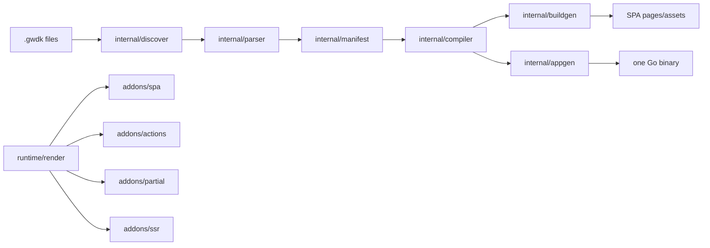

# Architecture

## Current Status

GOWDK is compile-first. The current repository discovers `.gwdk` files, parses
page, component, layout, endpoint, client, CSS, asset, and source-import
metadata into a typed GOWDK AST, lowers that AST into compiler IR, validates
route/render/component/handler contracts, emits manifest/site-map/build-report
metadata, and generates build-time SPA output, generated app source, local
binaries, and Go `js/wasm` deploy artifacts.

Generated build output covers simple static pages, literal dynamic `paths {}`
entries, literal and same-package/imported no-argument `build {}` data,
declared layouts, discovered components, page CSS, processor-emitted CSS,
partial-update client assets, generated JavaScript island assets, explicit
browser WASM island assets, route manifests, asset manifests, and cache
metadata. The build pipeline skips identical generated writes and can
incrementally render page-only SPA edits in the dev loop.

Generated apps use `runtime/app` and `net/http` handler contracts. They can
serve embedded build output, feature-bound action/API handlers, CSRF-wired
action POSTs, first supported action redirect and fragment responses,
standalone fragment routes, guards, rate-limit hooks, endpoint panic
boundaries, optional generated error documents, concrete and dynamic
`@render ssr` pages with declared `load {}` fields, safe local load redirects,
and bare `@render hybrid` pages as SPA output unless an explicit `load {}`
branch opts into request-time rendering. The app generator uses typed IR and
Go AST/printer output before `go/format`.

`runtime/contracts` now provides the first local typed registry for queries,
commands, backend-owned domain and integration events, presentation events, and
jobs. Compiler IR command/query references, `.gwdk` command/query syntax,
contract diagnostics, CLI graph/trace output, and runtime role filtering exist.
Generated adapters, split runtime binaries, durable outbox, and realtime fanout
for those contracts remain planned.

Still partial: broad local client-side reactivity, scoped component CSS/asset
emission, richer load/action invalidation, broader hybrid request-time
behavior beyond the explicit `load {}` branch, generated contract adapters,
app-wide middleware policy, and production operations guidance.

## System Context

GOWDK users write portable `.gwdk` pages and components. In the target architecture, the compiler discovers those files, builds a manifest, validates render rules, emits assets and Go handlers, and packages output for hosted files or one-binary deploy.

The target core output can include spa pages, components, typed actions, API handlers, server fragment handlers, embedded assets, and a Go binary. CSS tooling, including Tailwind, belongs in optional addons or plugins rather than the initial core. SSR is enabled only when `ssr.Addon()` is present and a page opts into request-time rendering.

## Compiler Lanes

Target `.gwdk` compilation:

```text
.gwdk file
  -> GOWDK parser
  -> GOWDK AST
  -> GOWDK analyzer
  -> generated normal Go code
  -> go/format
  -> go build
```

Target Go package validation:

```text
.go files
  -> standard go/parser
  -> standard go/ast
  -> standard go/types
  -> validate exported handlers/types
```

The GOWDK AST models `.gwdk` language constructs. Normal Go files and generated
Go source use the standard Go AST and type checker. Analyzer output connects
the lanes through package, route, type, component, and handler binding metadata.

## Components

| Component | Responsibility | Owner | Notes |
| --- | --- | --- | --- |
| `cmd/gowdk` | CLI entrypoint. | Core | Exposes `version`, `tokens`, `fmt`, `check`, `manifest`, `sitemap`, `routes`, `build`, `dev`, `preview`, `serve`, and `lsp`. `build` can emit spa files, generated embedded app source, an optional binary, and an optional WASM artifact for all discovered sources, selected configured modules, or spa `Build.Targets`; `dev` compares input content hashes, can use incremental spa rendering for page-only plain output changes, persists a dev input cache, serves static output, or runs/restarts a generated app binary for backend/SSR flows; `preview` builds and serves a local deploy preview, with `--hot` reusing the dev loop. |
| `gowdk` root package | Public config, render modes, addon registration, and CSS plugin contracts. | Core | Includes `Config`, `RenderMode`, `Addon`, `CSSConfig`, and `CSSProcessor`. |
| `internal/discover` | Find portable `.gwdk` files from include/exclude patterns. | Compiler | Recursive glob discovery implemented. |
| `internal/gwdkast` | Define the typed GOWDK source AST. | Compiler | Package declarations, typed page/component/layout/route/render/layout/guard/CSS declarations, component CSS scope/hash metadata, annotations, Go imports, GOWDK uses, stores, typed component contracts, blocks, endpoint declarations, parsed view nodes, literal records, and source spans implemented. |
| `internal/parser` | Parse `.gwdk` files into AST and manifest structs. | Compiler | First-slice parser for pages, components, layouts, route params, imported Go build functions, action/API metadata, component CSS scope/hash metadata, GOWDK `use` declarations, package declarations, package spans, and source spans implemented. `ParseSyntax` returns `internal/gwdkast.File`; manifest records remain for compatibility while compiler entrypoints move to analyzer IR. |
| `internal/gwdkanalysis` | Lower GOWDK AST into normalized compiler metadata. | Compiler | Lowers typed AST files into manifest compatibility records and `internal/gwdkir.Program`, including packages, routes, endpoints, templates, client behavior, source-selected assets with component CSS scope/hash metadata, stores, imports, uses, and source spans. |
| `internal/gwdkir` | Stable internal compiler IR shared by generated-output passes. | Compiler | Versioned IR for packages, source files, page routes, backend endpoints, templates, client behavior, asset scope/hash metadata, and generated output plans implemented. |
| `internal/view` | Parse and render the first spa `view {}` markup subset. | Compiler | Lowercase HTML elements, spa/boolean/expression attributes, shorthand class/id normalization, escaped text/attribute interpolation, self-closing component calls, prop/state interpolation, `g:on:*`, and `g:island` handling implemented. |
| `internal/gotypes` | Resolve Go props/state contracts for components. | Compiler | Uses `go list`, `go/parser`, and `go/types` to resolve imported structs and state init signatures. |
| `internal/lang` | Language tooling for lexing, diagnostics, formatting, checking, and manifest output. | Tools | Initial CLI-backed tools implemented. |
| `internal/lsp` | Language Server Protocol bridge for diagnostics, formatting, completions, and hover. | Tools | Dependency-free stdio server implemented with baseline and open-project completions plus hover for known language tokens and open-project symbols. |
| `internal/manifest` | Normalize discovered pages, routes, blocks, layouts, render modes, paths, and guards. | Compiler | Initial page model implemented. Public manifest JSON is currently narrower than the internal model. |
| `internal/project` | Load project-level config, module source groups, build targets, and future source roots. | Compiler | SPA `gowdk.config.go` subset implemented for build discovery, output, and `Build.Targets`; project-level CLI commands require this config or an explicit `--config` file before compiling `.gwdk` code. |
| `internal/compiler` | Validate manifests and coordinate compilation metadata. | Compiler | Render-mode, duplicate identity, redundant component implementation, component Go contract, route shape, duplicate route param, duplicate route pattern, route-method, required page-view validation, and backend binding implemented. CLI route/endpoint reports now convert through `internal/gwdkir.Program`. |
| `internal/buildgen` | Emit route-derived spa HTML files for build-time pages and SSR render artifacts. | Compiler | Disk builds, memory builds, incremental SPA builds, and SSR artifact planning consume `internal/gwdkir.Program`. Initial simple page, literal build data, imported Go build data calls, literal dynamic path expansion, component expansion, partial runtime asset emission, default JS island asset emission, explicit WASM island asset emission, concrete and dynamic SSR page rendering with declared `load {}` placeholders, route manifest emission, asset manifest emission, mandatory build report emission, identical-output write skipping, and incremental changed-page spa rendering implemented. |
| `internal/appgen` | Emit generated Go app source for embedded spa output and request-time routes. | Compiler | Auto route planning consumes `internal/gwdkir.Program`, backend adapter planning uses typed appgen IR, and generated app Go files are assembled with `go/ast`/`go/printer` before `go/format`. Generates `go.mod`, `main.go`, copied spa assets, thin `runtime/app` server wiring, `runtime/app.BackendRouter` registrations for feature-bound action/API routes, 501 stubs for missing/unsupported handlers, POST redirect and partial fragment action handlers backed by `runtime/form`, `runtime/response`, and `runtime/validation`, form input decoders, concrete and dynamic SSR route handlers backed by `runtime/route`, declared SSR load path calls with redirect/error-page handling, split backend apps, identical-output write skipping, stale embedded spa cleanup, and can invoke `go build` for local binaries or Go `js/wasm` artifacts. |
| `internal/clientrt` | Emit client runtime for partial updates. | Runtime | First partial form enhancement runtime emits lifecycle hooks, target/swap request headers, swaps, focus restoration, and loading state metadata. |
| `runtime/render` | Core rendering engine used by spa, actions, partials, and SSR. | Runtime | Renderer and generated-code builder implemented; expression text writes escape by default. |
| `runtime/component` | Generated component runtime contract. | Runtime | Initial component interface implemented. |
| `runtime/html` | HTML escaping, attributes, and class helpers. | Runtime | Initial helpers implemented. |
| `runtime/form` | Form value normalization and scalar helpers for generated decoders. | Runtime | Values, first-slice allowlist decoding, and scalar parse helpers implemented; typed struct shape decoding is generated from Go AST instead of runtime reflection. |
| `runtime/validation` | Validation result and errors for actions. | Runtime | Initial result model implemented. |
| `runtime/response` | HTML, redirect, fragment, and JSON response envelopes. | Runtime | Initial response model implemented. |
| `runtime/asset` | Asset manifest resolution. | Runtime | Initial manifest helper implemented. |
| `runtime/route` | Runtime route matching for generated request-time routes. | Runtime | Dynamic route matcher for first-slice generated SSR routes implemented. |
| `runtime/app` | Shared generated app HTTP server. | Runtime | Serves embedded spa files, identity headers, health checks, asset manifest counts, optional generated 404/500 pages, no-JS cookie acknowledgement, server-side cookie notice hiding, generated CSRF token injection for POST forms, request-time panic boundaries, and action/SSR callback hooks for generated apps. |
| `runtime/contracts` | Typed contract registry and in-process dispatch. | Runtime | First runtime slice implemented for queries, commands, backend-owned domain and integration events, presentation events, jobs, metadata, local command-buffered event dispatch, event-envelope capture, and a dependency-free outbox interface. Compiler/generator integration and durable outbox adapters remain planned. |
| `addons/spa` | Build-time prerendering. | Addon | Capability boundary implemented; prerender execution is planned. |
| `addons/actions` | Typed backend actions, form decoding, CSRF. | Addon | Capability boundary, required-field validation helper, generated required-field validation fragments for partial requests, signed CSRF validator, and generated action CSRF wiring implemented; broader field-specific validation patterns remain planned. |
| `addons/partial` | Server fragments and swaps. | Addon | Capability boundary implemented; first generated action fragment execution slice exists. |
| `addons/ssr` | Request-time full-page rendering. | Addon | Capability boundary plus load context, declared load path resolution, safe local redirect errors, guard execution, router registration, layout stack, and default error handler contracts implemented; generated embedded apps can serve concrete and dynamic SSR pages with declared load paths. |
| `addons/api` | Generated API handlers. | Addon | Capability boundary implemented; feature-bound handler generation exists for supported API signatures. |
| `addons/embed` | Embedded assets and one-binary serving. | Addon | Capability boundary implemented; generated app source, local binaries, and Go `js/wasm` deploy artifacts can embed selected build output. |
| `addons/css` | Compile-time CSS processing. | Addon | CSS feature registration and processor aliases implemented. |
| `addons/tailwind` | Tailwind CSS standalone CLI integration. | Addon | Experimental no-npm Tailwind v4 CSS processor wrapper; users provide the executable. |
| `addons/ratelimit` | Request-time HTTP rate limiting. | Addon | Middleware, fixed-window result contract, in-memory store, Redis-backed store adapter, and generated request-time handler registration hook implemented. Generated apps call registered limiters for action, API, fragment, SSR, and split-backend proxy handlers before guards and user logic while user-owned Go chooses policy and store implementation. |

## Data Model

The internal compiler manifest includes page identity, source path, route, render mode, layouts, guard metadata, whether spa paths exist, captured `paths {}` and `build {}` source text, and declared blocks. Current public manifest JSON is intentionally smaller: it includes route, effective render mode, layouts, paths presence, and guards. Site-map JSON includes source paths, dynamic params, and block presence for editor tooling.

Generated spa binaries embed this manifest with the rest of the spa output,
but request-time generated route handlers do not consume it yet.

Example manifest shape:

```json
{
  "pages": {
    "home": {
      "route": "/",
      "render": "spa",
      "layouts": ["root"]
    },
    "blog.post": {
      "route": "/blog/{slug}",
      "render": "spa",
      "paths": true,
      "layouts": ["root", "blog"]
    },
    "dashboard": {
      "route": "/dashboard",
      "render": "ssr",
      "layouts": ["root", "dashboard"],
      "guard": ["auth.required"]
    }
  }
}
```

## API And Integration Contracts

Application config:

```go
var Config = gowdk.Config{
	AppName: "Clinic",
	Source: gowdk.SourceConfig{
		Include: []string{
			"src/**/*.gwdk",
		},
	},
	Modules: []gowdk.ModuleConfig{
		{Name: "frontend", Type: "frontend"},
		{
			Name: "admin",
			Type: "admin-ui",
			Source: gowdk.SourceConfig{
				Include: []string{"frontends/admin/**/*.gwdk"},
			},
		},
		{
			Name: "backendmicroservice",
			Type: "backendmicroservice",
			Source: gowdk.SourceConfig{
				Include: []string{"services/backend/**/*.gwdk"},
			},
		},
	},
	Render: gowdk.RenderConfig{
		Default: gowdk.SPA,
	},
	Build: gowdk.BuildConfig{
		Output: "dist/clinic",
		Assets: gowdk.Embed,
	},
	Addons: []gowdk.Addon{
		SPA.Addon(),
		actions.Addon(),
		partial.Addon(),
		embed.Addon(),
		ssr.Addon(),
	},
}
```

Block semantics:

- `paths {}` runs at build time and declares dynamic spa routes.
- `build {}` runs at build time and feeds spa rendering.
- `load {}` runs at request time and requires SSR or hybrid rendering.
- `act Name POST "/path"` declares POST/action endpoints.
- `api Name METHOD "/path"` declares API endpoints.
- `view {}` renders markup.

Target generated route behavior:

```go
mux.HandleFunc("GET /", embedded.SPA("pages/home.html"))
mux.HandleFunc("POST /newsletter", actions.NewsletterSubscribe)
mux.HandleFunc("GET /dashboard", ssr.RenderDashboard)
mux.HandleFunc("GET /api/patients", api.PatientsIndex)
```

The current code can plan route metadata for CLI reports and can emit SPA HTML files, CSS assets from compile-time processors and discovered page CSS inputs, stylesheet links, page-aware processor stylesheet selections, `gowdk-routes.json`, `gowdk-assets.json`, `gowdk-build-report.json`, the partial-update client runtime, and generated island runtime assets when needed for simple build-time pages with explicit or discovered component and layout files. It expands the first literal `paths {}` subset for dynamic SPA routes, binds those route params plus literal `build {}` data or imported Go build data into the current SPA `view {}` interpolation context, resolves typed component props/state contracts from Go module imports, runs state init functions at build time, and composes SPA page layouts through each layout's single `<slot />`; literal `build {}` string values can also interpolate current route params. It parses the supported action body subset and can generate SPA POST redirect handlers plus form input decoders, required-field validation wrappers, typed same-package action decoder glue, user action/API calls, CSRF token wiring when `Build.CSRF.Enabled` is set, and partial fragment responses for concrete page routes. `gowdk build --app` can also generate concrete and dynamic SSR routes for `@render ssr` pages, with dynamic route matching, generated typed route-param bindings backed by `runtime/route`, and `load {}` execution for declared fields; generated SSR load functions can return safe local redirects, generated SSR load failures can render optional `500.html`, and generated apps can render optional `404.html` for not-found responses. Generated guarded SSR, action, and API routes expose `RegisterGuards`, run the declared guard IDs, allow registered guard success paths, and fail closed when a guard registry is missing or a guard rejects the request. Generated SSR, action, and API lanes also recover panics before response headers are written as no-store HTTP 500 responses without exposing panic values. Bare `@render hybrid` pages are treated as build-time SPA output until an explicit request-time capability such as `load {}` is declared. `gowdk build --app` can generate an embedded Go app from that output, and `--bin` can compile it. `gowdk serve` can serve the generated SPA directory locally. It does not implement arbitrary client expressions yet. Only pages marked `@render ssr` or accepted hybrid request-time branches should use request-time full-page rendering.

Guard annotations are parsed and exposed in manifest/site-map output. The SSR
addon defines guard function and ordered execution contracts, and generated
handlers enforce declared guard IDs before request-time user logic. Generated
app packages with guarded routes expose `RegisterGuards` so app startup code can
register application-owned guard functions without feature packages importing
generated output.

Language tool commands:

```sh
gowdk tokens <file.gwdk>
gowdk fmt [--write] <file.gwdk>
gowdk check [--ssr] <file.gwdk>
gowdk manifest [--ssr] <file.gwdk>
gowdk sitemap [--ssr] <files>
gowdk build [--config <file>] [--debug] [--ssr] [--target <name>] [--module <name>] [--out <dir>] [--app <dir>] [--bin <file>] [--wasm <file>] [files...]
gowdk dev [--addr <addr>] [--interval <duration>] [build flags...]
gowdk serve --dir <dir> [--addr <addr>]
gowdk lsp [--ssr]
```

The user-facing documentation set for this pipeline is:

- `docs/getting-started.md` for clone, build, scaffold, build, and serve.
- `docs/reference/cli.md` for working commands and flags.
- `docs/reference/config.md` for the spaally loaded config subset.
- `docs/reference/routing.md` for route validation, route plans, and generated
  route behavior.
- `docs/reference/deployment.md` for spa, generated app, binary, and WASM
  deploy outputs.
- `docs/compiler/pipeline.md` and `docs/compiler/browser-compiler.md` for
  compiler and browser-facing output stages.
- `docs/language/` for supported and unsupported `.gwdk` syntax.
- `examples/README.md` for examples that match the actual compiler slice.

Project-level compiler commands load `gowdk.config.go` from the current directory, or an explicit `--config <file>`, before compiling, validating, or inspecting `.gwdk` code. Explicit file paths narrow the input set but do not bypass the config requirement. When `gowdk build` receives no explicit files, it loads literal root source, module source, and build target settings from the config. A module with a name but no explicit include defaults to `<module-name>/**/*.gwdk`. Configured `Build.Targets` declare named module sets, output dirs, generated app dirs, binary paths, and WASM paths; with targets configured, `gowdk build` runs every target and `--target <name>` limits the run to selected targets. `--module <name>` remains available for ad hoc builds and may be repeated or comma-separated. The selected modules define the source set compiled into `--out`, copied into `--app`, and embedded into `--bin` or `--wasm`, so projects can build one-module binaries, multi-module binaries, WASM artifacts, or different artifacts from different module sets. If the loaded config has no root or module includes, discovery uses `**/*.gwdk` under the current working directory. Discovery excludes `.git`, `vendor`, `node_modules`, `testdata`, configured source excludes, and the selected output directory. Module type is user-defined metadata today; future generated-output work can use it to separate frontend, backend, and service artifacts. The VS Code extension uses `gowdk sitemap` to render a visual route map. Because routes are declared inside `.gwdk` files, the visualizer can move a page file without changing the page route.

LSP-capable editors can use `gowdk lsp` over stdio for live buffer diagnostics,
document formatting, completions, and hover. The first LSP version uses
full-document synchronization and validates one open buffer at a time with the
same parser and compiler rules as `gowdk check`.

## Key Quality Attributes

- Scalability: spa output should serve without request-time page rendering.
- Reliability: invalid render modes and missing addon requirements must fail at compile time.
- Security: actions must own form decoding, validation, CSRF, and redirect behavior.
- Observability: manifests and site maps should explain route behavior and render mode.
- Maintainability: runtime render core stays separate from `addons/ssr`.

## Diagrams


